# 1.Contents of the source directory
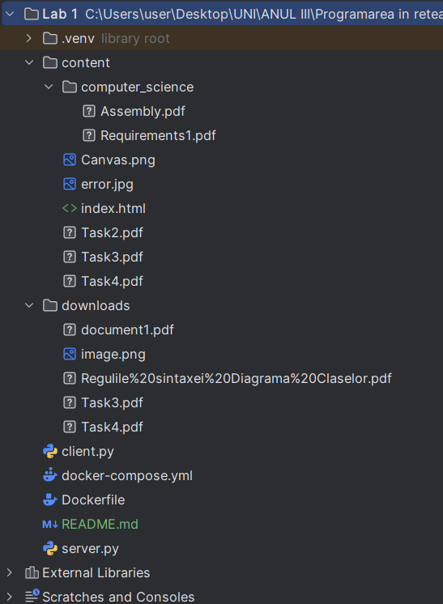  
In the photo above you can see the full contents of the source directory.
# 2.The docker-compose and the docker files.
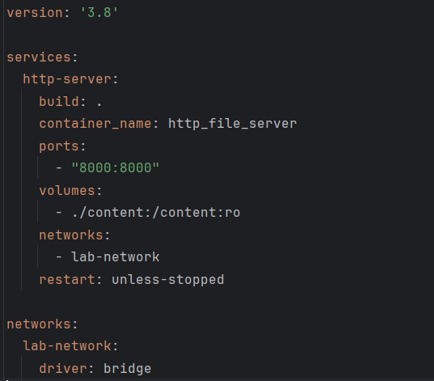  
The photo above is the docker-compose file.
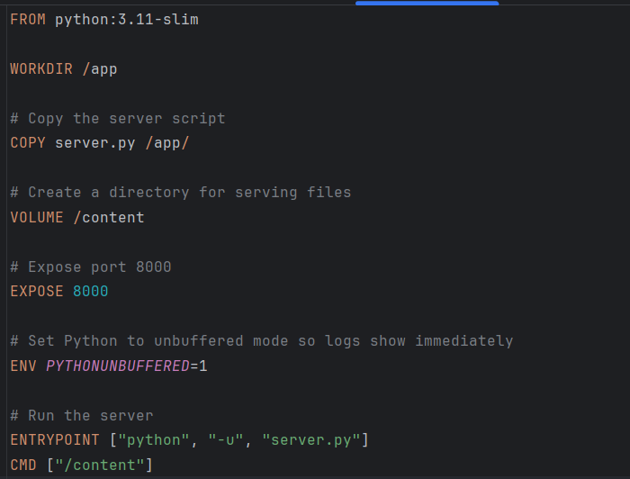  
The photo above is the docker file.
# 3.The command to start the docker
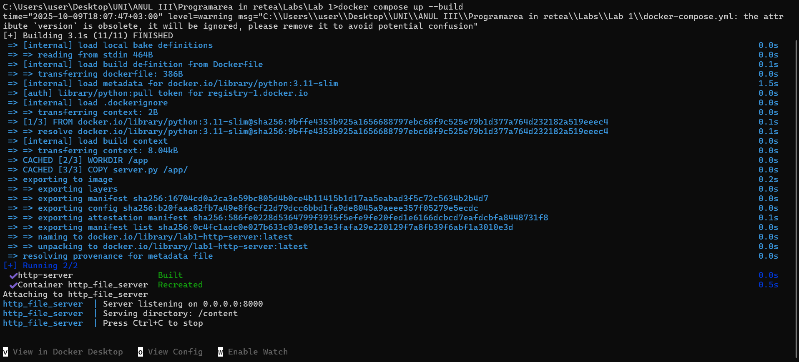  
The photo above shows the command that I use to start the docker container.
# 5.Content folder  
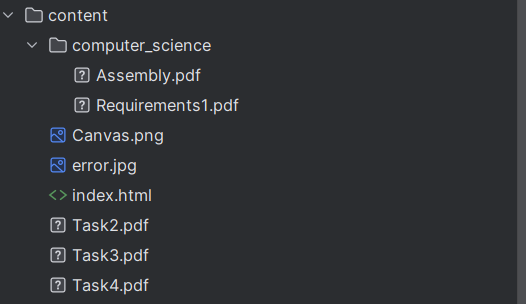  
The photo shows all the files from the content folder.
# 6.Request of 4 files
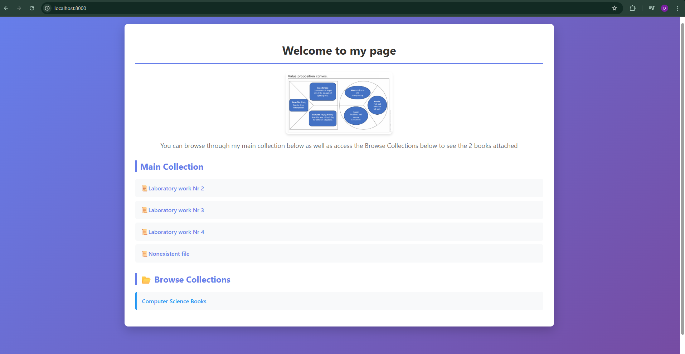  
The picture above shows the HTML file with the image.
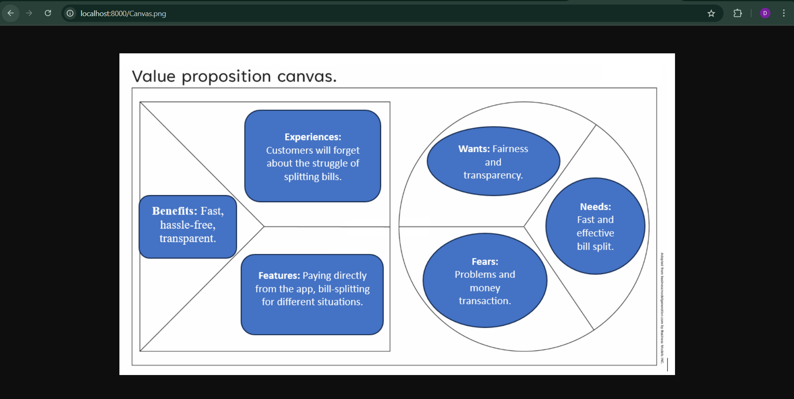  
The picture above shows the PNG file. 
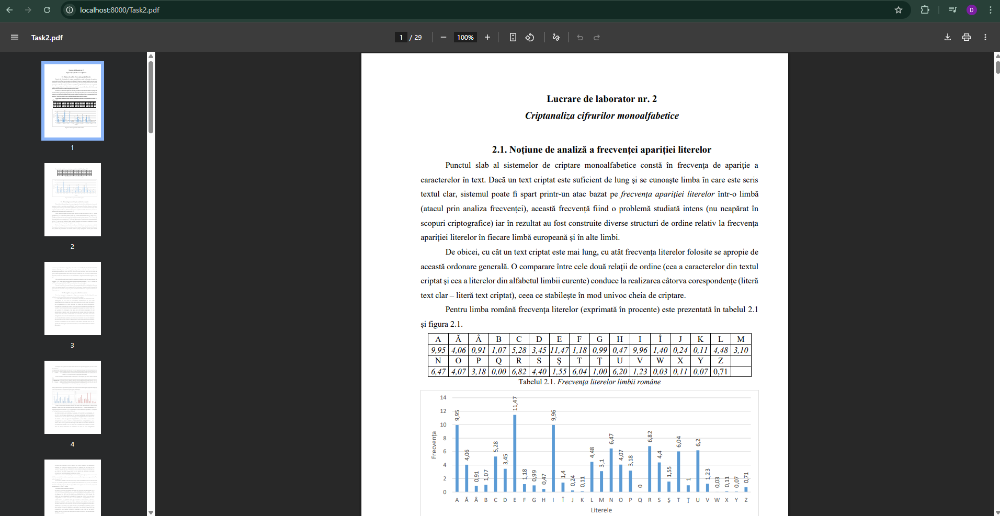  
The picture above shows the PDF file opened in browser.
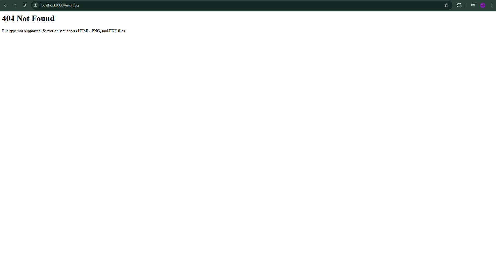  
The picture above shows the error page since the file opened is an unknown extension.
# 7.Client running and output
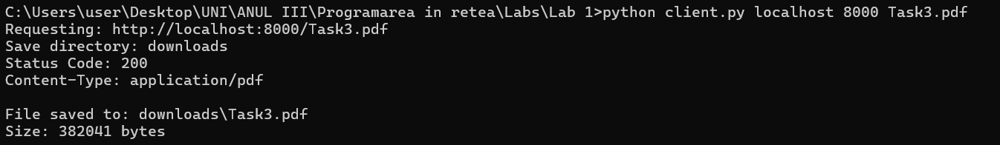
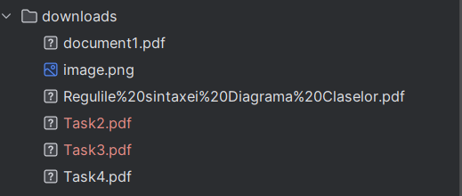

The two images above show the command I ran in the terminal to download a pdf file and how it is saved to the downloads folder.
# 8. Directory and subdirectory
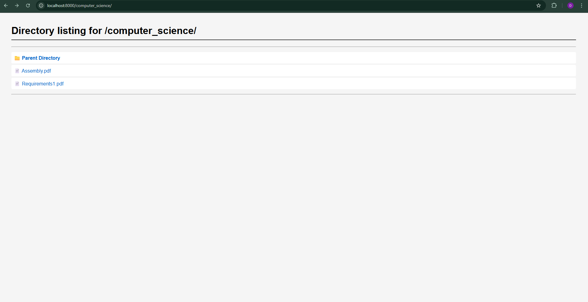  
The picture shows the directory listing for /computer_science/.
  
The picture shows an accessed pdf from the directory.
# 9.Friend Server
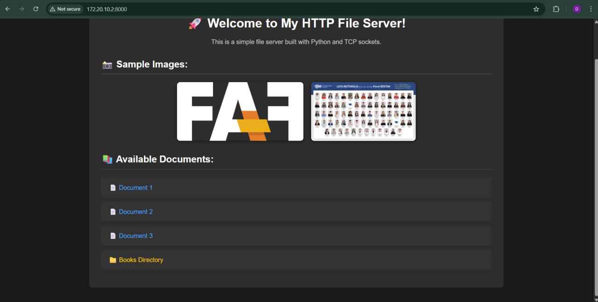  
The photo shows the friend's HTML file with the image.
  
The photo shows the friend's PNG file.
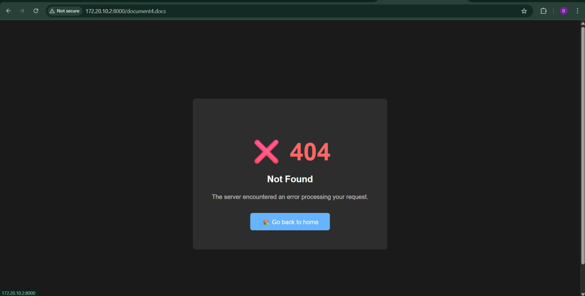  
The photo shows friend's inaccessible file. 
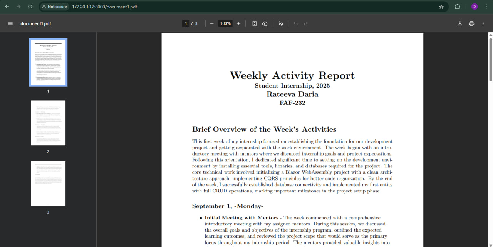  
The image shows friend's pdf document page.
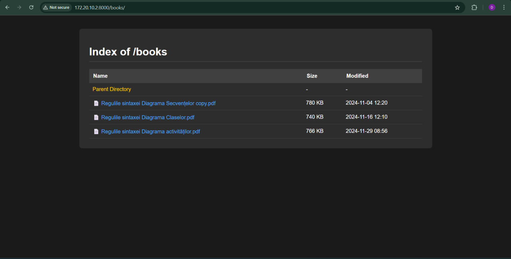  
The photo shows the directory page of my friend.
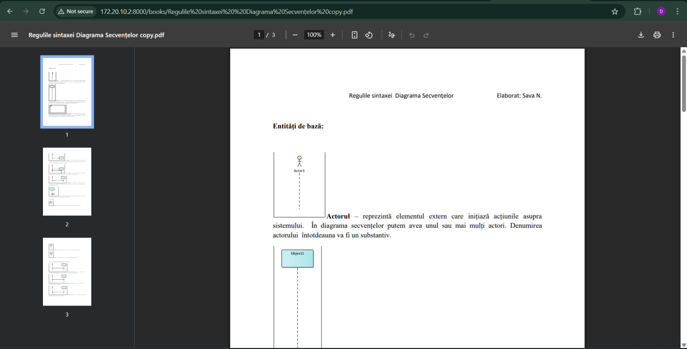  
The photo shows the pdf from the friend's directory page.
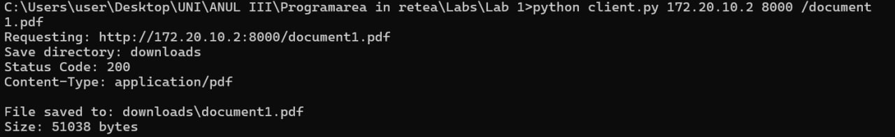  
The picture shows the command I ran in order to download a document from my friend's server.
  
The photo shows the downloaded document from the friend's server.
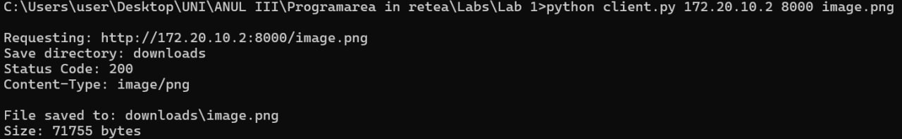  
The picture shows the command I ran in order to download a document from my friend's server.
  
The photo shows the downloaded png from the friend's server.
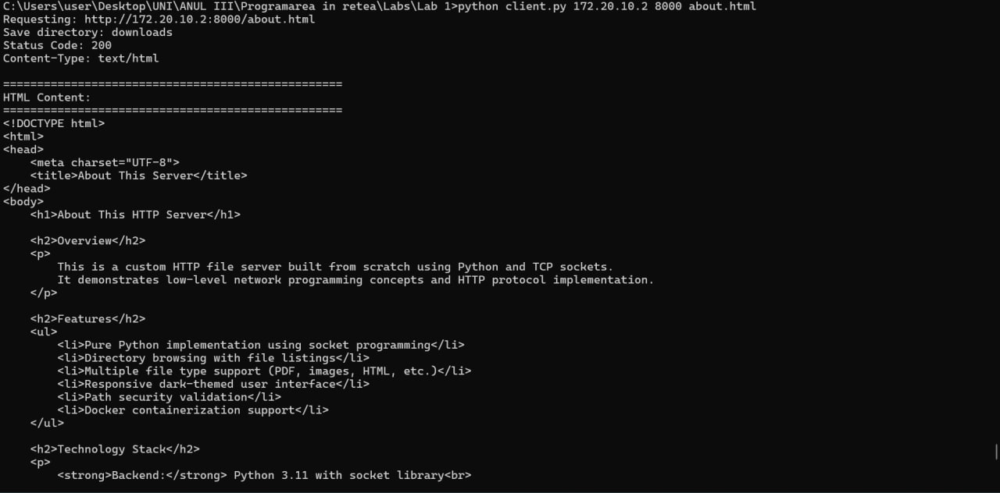  
The photo shows how the HTML is shown in the terminal.
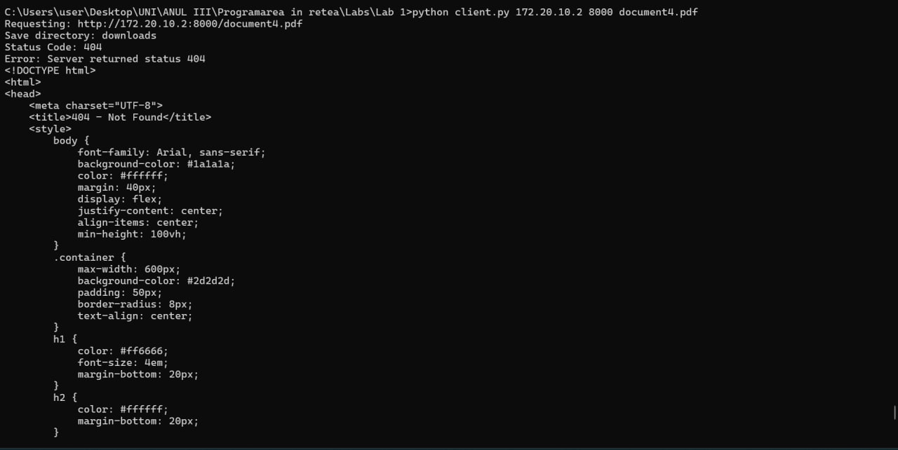  
The photo shows the 404 error I get in the terminal from my friend upon accessing the inexistent file.
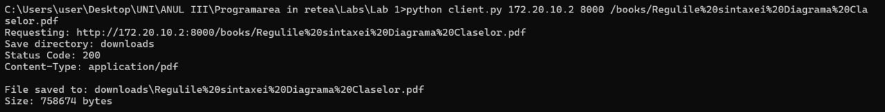  
The picture shows the command I ran in order to download a pdf from my friend's server.
  
The photo shows the downloaded png from the friend's server.

