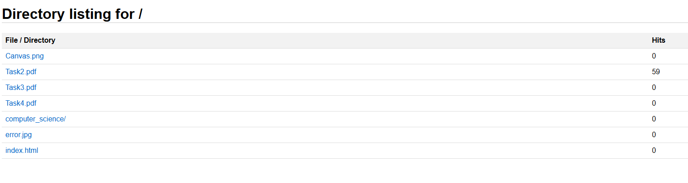
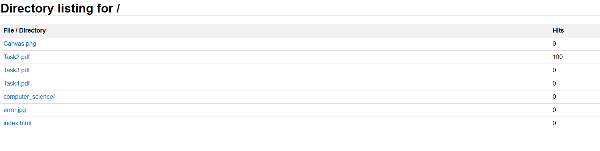
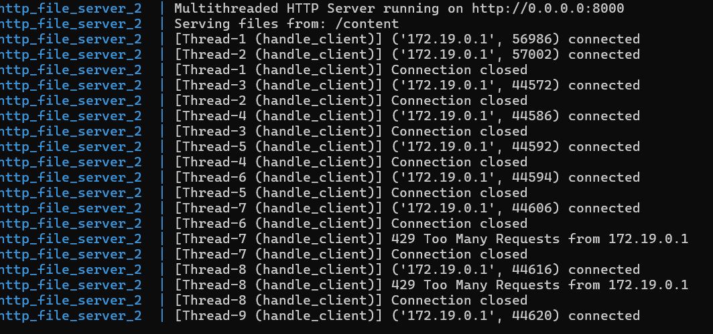

# Concurent requests to the single threaded and the multithreaded server
## 1. Single threaded server VS Multithreaded server
### Single threaded server
  
As you can see in the image above the single threaded server took 10.04 seconds to process 10 requests.
### Multithreaded server 
  
As you can see in the above image the multithreaded server performed a lot better compared to the single threaded server handling 10 requests in just 1.1s.
## 2. Counter
### Race condition
  
As you can see in the image above I have sent 100 concurrent requests to demonstrate the race condition with the naive counter implementation and just 59 of them were counted because the rest did not sync.
  
The image shows the 59 hits performed on the Task2.pdf file.
### Thread safe test
  
The image shows the 100 concurrent requests and that all of them were confirmed due to the lock implementation which shows that the race condition disappeared and that the sync works as expected.
  
The image above shows all the 100 successful hits on the Task2.pdf file.
## 3. Rate limiting
  
In the image is clearly seen how the rate limit is achieved after sending 20 fast concurrent requests and that just 9 of them were successful since the rest 11 achieved the rate limit. Also in the second part of the image it is seen how all 10 requests are successful if are sent at a lower pace.
  
The image shows the error the user is prompted in the web for to many requests.
  
The image shows the same 429 too many requests error from the logs.