# Memory Scramble Game

A multiplayer memory card matching game with concurrent player support.

## Screenshots

### Game Interface
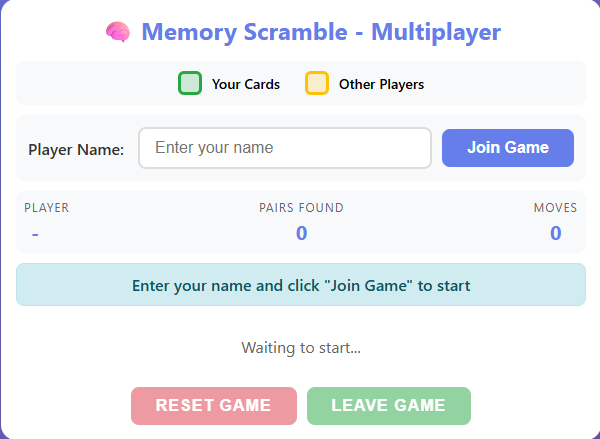

"Players join the game by typing their name, then play on a 5×5 board where green cards are yours and yellow cards belong to other players.

### Multiplayer Demo
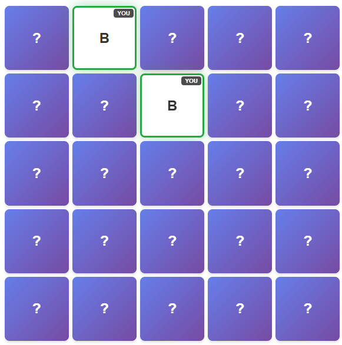
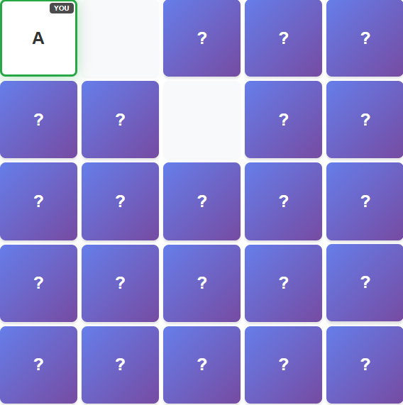
When two cards match, they stay face-up with a green border, and then disappear from the board after the next card is flipped.  
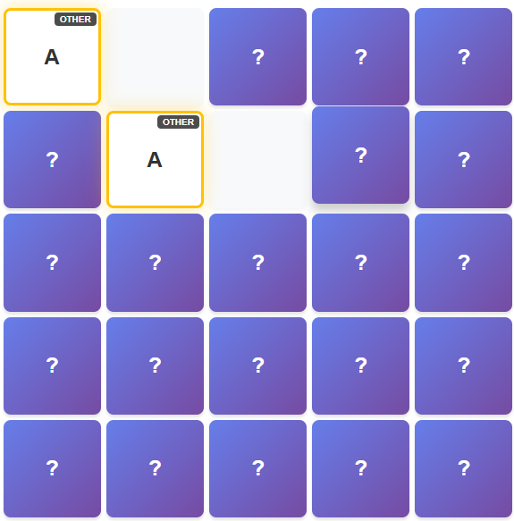
Other players see cards flipped by opponents with a yellow border and 'OTHER' label, showing real-time multiplayer updates.  
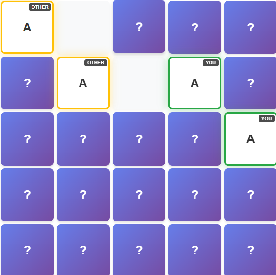
Multiple players can play at the same time, with green borders showing your cards and yellow borders showing other players' cards.  
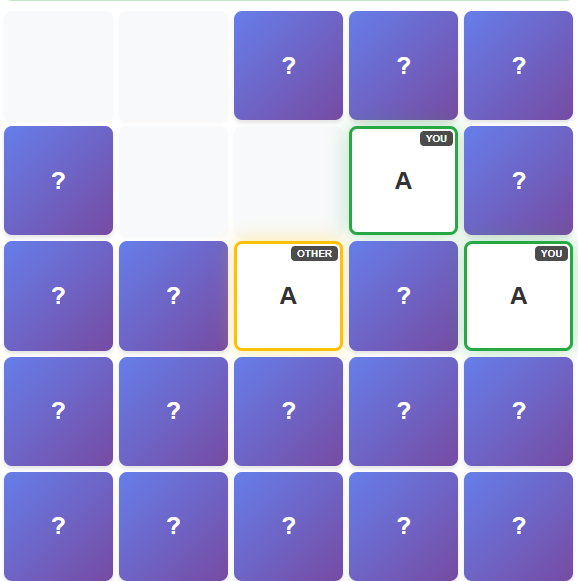
Cards disappear from the board when players find matching pairs, creating empty spaces on the grid.  
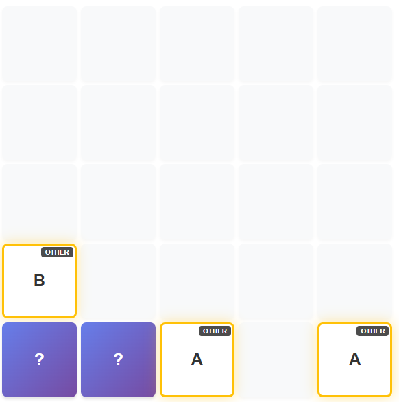
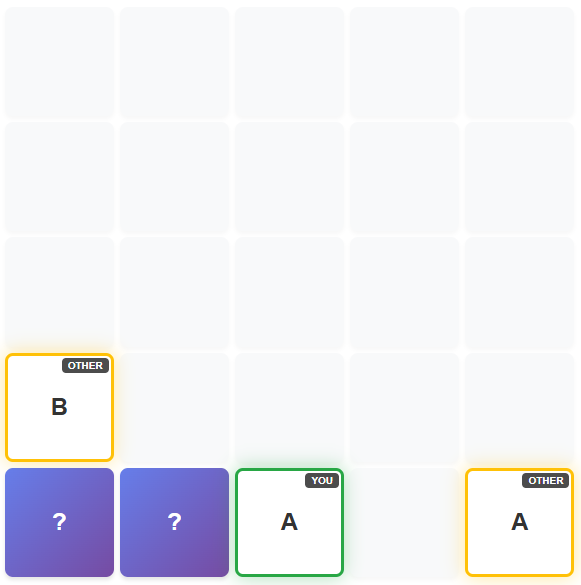
When cards don't match, the player with one card keeps it under control (green), while non-matching cards from another player become uncontrolled (yellow border changes).  

### Unit Tests
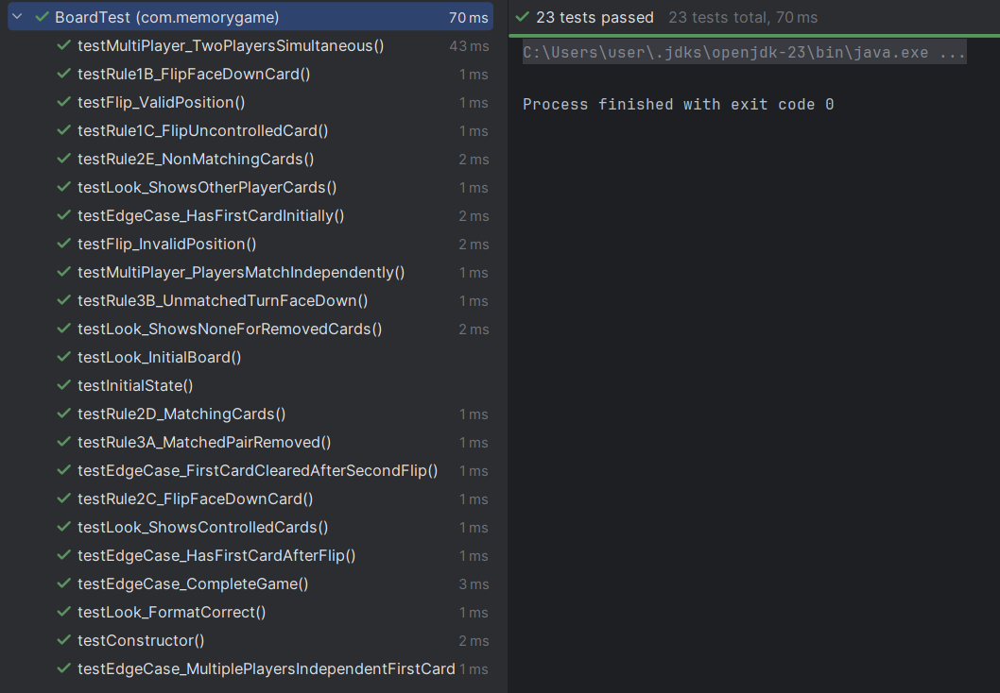
All 23 unit tests pass successfully, covering game rules, multiplayer scenarios, and edge cases.

### Simulation
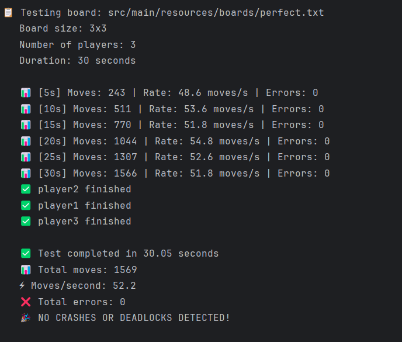
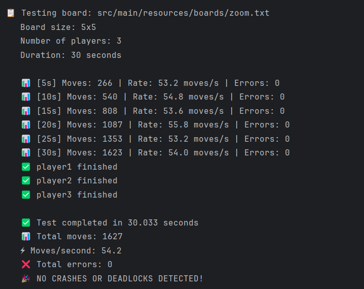
Stress test simulation runs 3 players making random moves for 30 seconds on different board sizes, completing over 1500 moves with zero errors or crashes.

### Project Structure
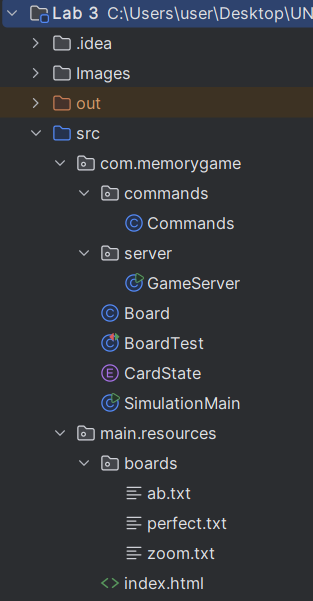
Three-layer architecture with Board (game logic), Commands (application layer), and GameServer (HTTP layer), following clean separation of concerns.