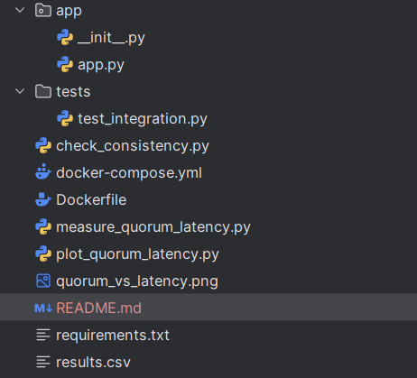
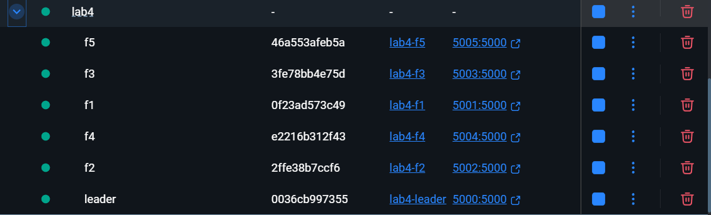
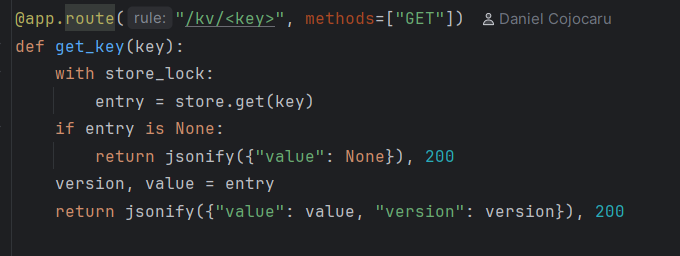
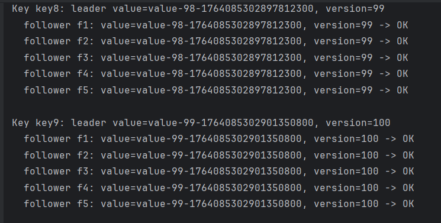
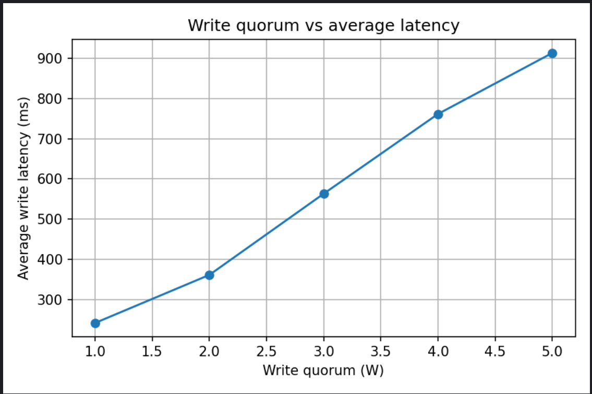

# Lab 4 – Single-leader Replicated Key-Value Store

## Introduction

This project implements a simple key-value store with one leader and five followers using semi-synchronous replication and a configurable write quorum.

## Architecture

- One leader handles all client writes and reads.
- Five followers receive replicated writes from the leader.
- Leader stores `(version, value)` per key and replicates to all followers over HTTP/JSON.
- Leader waits for `WRITE_QUORUM` follower acks before confirming a write.

## Implementation

- `app.py`: Flask service that runs as leader or follower based on `NODE_ROLE`.
  - Leader: `PUT /kv/<key>` updates local store, starts replication threads, waits for quorum.
  - Follower: `POST /replicate` applies incoming `(key, value, version)` if version is newer.
  - Both: `GET /kv/<key>` returns current value and version; `GET /health` shows role.

- `docker-compose.yml`: starts leader and followers from one image and configures env vars.
- `measure_quorum_latency.py`: runs 100 writes (10 at a time) for WRITE_QUORUM = 1..5 and saves `results.csv`.
- `plot_quorum_latency.py`: plots `quorum_vs_latency.png` from `results.csv`.
- `check_consistency.py`: compares leader and follower values for keys `key0..key9`.

## How to Run

